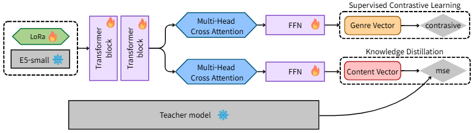

## Dual-Target Strong KD for Book Embedding Reconstruction

본 프로젝트는 메타데이터가 없는 환경에서 강력한 Knowledge Distillation과 Multi-Vector Latent Query Attention을 통해 도서 도메인에 특화된 임베딩 공간을 안정적으로 재구성하는 것을 목표로 한다.

### Motivation
범용 임베딩 모델(E5, GTE 등)은 일반적인 문장 유사도에는 효과적이지만, 도서 검색과 같이 장르 구분과 의미 유사도를 동시에 요구하는 문제에서는 한계를 보인다.
특히 명시적 메타데이터가 없는 환경에서는 모든 구조를 텍스트만으로 추론해야 하므로, 임베딩의 표현력과 학습 안정성이 핵심 과제가 된다.

### Core Contributions
- 대규모 Strong KD를 통한 임베딩 학습 안정화
- 장르/의미 목표 간 gradient 충돌 완화
- Multi-vector latent query를 통한 장르/내용 의미 분리 구조
- Dual-target KD를 통한 semantic manifold 보존

### Training Strategy
- LoRA 기반 파인튜닝으로 과적합 방지
- Strong KD와 gradient alignment 적용
- Curriculum scheduling으로 genre/content 학습 균형 조절

### Experimental Results
| Model | MRR |
|------|-----|
| Original E5 | 0.583 |
| Phase 1 (Strong KD) | 0.676 |
| Phase 2 (Proposed) | **0.706** |
| Oracle (with category) | 0.716 |
